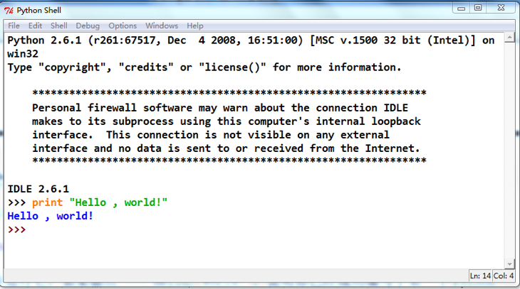

# 一.第一个Python程序

##1 首先先来一个Hello World试试

  &#160; &#160; &#160; &#160;在Python的官方网站可以下载到Windows下的安装包(Mac系统自带)，按照提示一路下去就可以了，记得要将Python所在的目录加入到系统Path变量中。Python的安装包自带了一个简单的集成开发环境IDIE，你也可以选一个自己喜欢的IDE，我个人推荐PythonWin,它的语法提示功能不错，适合初学者使用。现在你可以打开IDIE新建一个py为扩展名的Python脚本文件，输入以下内容：
  
  &#160; &#160; &#160; &#160;保存并运行它，如果输出>>>Hello ,World!，这说明你已经成功编写了第一个Python程序，恭喜你！为了比较Python与Java编码风格等方面的差异，下边给出一个稍微复杂些的”Hello world”程序以及它的Java对照版本。


**Java的实现**
```
public class myfirstjava
{
	public static void main(String[] args)
	{
		System.out.println("这是Java的第一个程序");
	}
}
```
**Python的实现**
>>请注意第一行代码是为了支持中文，没有这一行代码的话，我们在下面如果输出中文就会出错的。

```
#-*-coding:utf-8-*-
"""
我的第一个应用程序
"""
# -*- coding:utf-8 -*-
"""
我的第一个应用程序
"""

import sys
def Main():
    sys.stdout.write("Hello World 这是中文\n")
# 下面的语句看起来比较奇怪,一会儿我们会解析它
if __name__=="__main__":
    Main()
```
## 2 为什么要学习Python
  &#160; &#160; &#160; &#160;我学习过很多语言，C#、Java、C/C++、PHP，但是效高即高而且简单易懂的也就数Python了，可以说它是一种胶水语言，我们可以通过它将许多语言整合在一起使用。
我们来看一段代码：

```
#-*-coding:utf-8-*-
"""
my fist App
"""
import sys
import urllib
def Main():
    htmlresult=urllib.urlopen("http://www.baidu.com").read()
    print htmlresult
#this is test
if __name__=="__main__":
    Main()
```

1. 代码块与缩进的差异

    Java使用C/C++风格的编码形式，除了要求用{}组织代码块外，语句间的缩进可以是任意的。Python强制所有程序都有相同的编码风格，它通过缩进来组织代码块，缩进相同的语句被认为是处于同一个代码块中，在if/else等语句及函数定义式末尾会有一个冒号，指示代码块的开始。Python这种强制缩进的做法可以省去{}或者begin/end等，使程序的结构更为清晰（有的人认为恰好相反），同时也减少了无效的代码行数。此外需要注意，尽量使用4个空格作为Python代码的一个缩进单位，最好不要使有TAB，更不要混用Tab和空格，这也算是Python的一个非强制性约定吧。

2.	语句结尾的差异

    Java用分号结尾，Python不用任何符号（类似BASIC）。实际上Python也可以使用分号结尾，像这样a=1;b=2;c=3;print a,b,c不过Python中这种风格多用于调试，应为你可以很容易注释掉这一行就删除了所有的调试代码。另外，当一行很长时，Python可以用\符号折行显示代码。

3.	注释方法

    java//用单行注释,用/**/进行多行注释，而Python用#符号进行单行注释，用三引号（可单可双）进行多行注释。java的条件表达式必须要加括号，而Python的条件表达式加不加括号均可。

4.	入口方法

    java语言必须要有入口方法Main(),这是程序开始执行的地方。Python语言中没有入口方法（函数），作为解释型的语言，Python代码会自动从头执行。
    如果你对这点不习惯，可以使用Python代码的内置属性__name__此属性会根据Python代码的运行条件变化：当Python代码以单个文件运行时，__name__便等于__main__，当你以模块形式导入使用Python代码时，__name__属性便是这个模块的名字。
    当然，Python中的__name__属于并不是为了照顾C/C++/C#程序员的编程习惯而准备的，它主要目的是用于模块测试。想像一下在C#中编写一个组件或类代码时，一般还得同时编写一个调用程序来测试它。而Python中可以把二者合二为一，这就是__name__属性的真正作用。

5.	import与using语句

    在用Python写代码时，我们首先import sys，这是导入了Python的sys模块，然后在代码里我们可以引用sys模块中的对象stdout及它的write方法。在Python中这是必须的，否则你无法调用sys模块中的任何东西。
    简单的说，Python中的import相当于java中的包引用。最后import可以出现在代码的任何位置，只要在引用它之前出现就可以了，不过为了提高程序可读性，建议还是在所有代码开头书写import

###小结
1. Python使用强制缩进的编码风格，并以此组织代码块
2. Python语句结尾不用分号
3. Python标明注释用#(单行)或三引号（多行）
4. Python语言没有入口方法（Main）,代码会从头到尾顺序执行
5. Python用import引用所需要的模块
