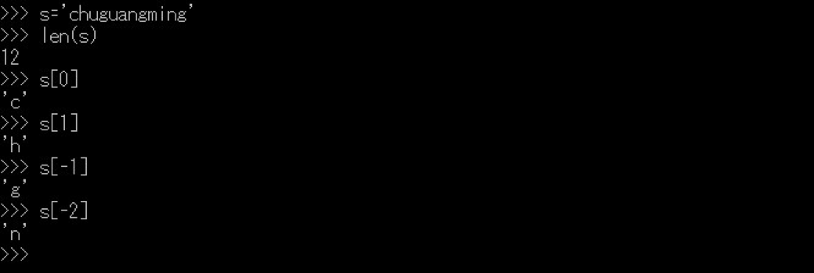
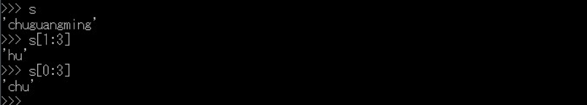
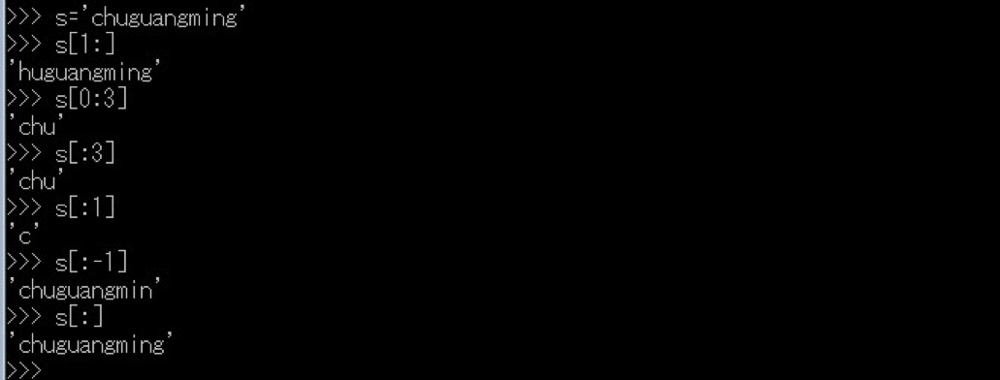
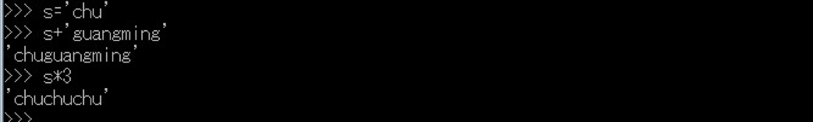

# 第六章 字符串与正则表达式

  &#160; &#160; &#160; &#160;本章将介绍Python中字符串和正则表达式的概念。字符串是程序开发中常用的数据类型，字符串的处理是实际应用中实际应用中经常面对的问题。Python提供了功能强大的字符串模块，正则表达式专门用于匹配应用中的数据，能够简化字符串的处理程序，Python提供了re模块用来匹配正则表达式。
  
  &#160; &#160; &#160; &#160;如果我们有一个含有12个字符的字符串，我们通过内置的len函数验证其长度并通过索引操作得到其各个元素。
  
  
  &#160; &#160; &#160; &#160;在Python中，索引是按照从最前面的偏移量进行编码的，也就是从0开始，第一项索引为0，第二项索引为1，依次类推。在python中，我们能够反向索引，从最后一个开始。




  &#160; &#160; &#160; &#160;除了简单的从位置进行索引，序列也支持一种所谓分片的操作，这是一种一步就能够提取整个分片的方法。例如：
  

###解决中文字符的问题

```
#-*- coding:utf-8 -*-
from __future__ import unicode_literals
print(type("test")) # output: <type 'unicode'>
spam = "测试字符串"
print(spam[1:3]) # output:试字
```

###单双引号的区别

先说1双引号与3个双引号的区别，双引号所表示的字符串通常要写成一行 如： 

**s1 = "hello,world" **

如果要写成多行，那么就要使用\ (“连行符”)吧，如 

```
s2 = "hello,\ 
world" 
```

s2与s1是一样的。如果你用3个双引号的话，就可以直接写了，如下： 

```
s3 = """hello, 
world, 
hahaha."""
```

那么s3实际上就是"hello,\nworld,\nhahaha.", 注意“\n”，所以， 如果你的字符串里\n很多，你又不想在字符串中用\n的话，那么就可以使用3个双引号。而且使用3个双引号还可以在字符串中增加注释，如下： 

```
s3 = """hello,  #hoho, this is hello, 在3个双引号的字符串内可以有注释哦 
world,          #hoho, this is world 
hahaha.""" 
```

这就是3个双引号和1个双引号表示字符串的区别了，3个双引号与1个单引号的区别也是和这个一样的，实际上python支持单引号是有原因的，下面我来比较1个单引号和 1个双引号的区别。 

当我用单引号来表示一个字符串时，如果要表示 Let's go 这个字符串，必须这样： 

s4 = 'Let\'s go'，注意没有，字符串中有一个'，而字符串又是用'来表示，所以这个时候就要使用转义符 \ （\，转义符应该知道吧）, 如果你的字符串中有一大堆的转义符，看起来肯定不舒服，python也很好的解决了这个问题，如下： 

**s5 = "Let's go" **

这时，我们看，python知道你是用 " 来表示字符串，所以python就把字符串中的那个单引号 ' , 当成普通的字符处理了，是不是很简单。 对于双引号，也是一样的，下面举个例子 

**s6 = 'I realy like "python"!' **

这就是单引号和双引号都可以表示字符串的原因了。

###字符串的格式化
  &#160; &#160; &#160; &#160;C语言使用函数printf()、sprintf()格式化输出结果，Python也提供了类似的功能。Python将若干值值插入到带有%标记的字符串，从而可以动态的输出字符串。字符串的格式化语法如下所示：

```
#-*-coding:utf-8-*-
import sys
if __name__=="__main__":
    #格式化字符串
    str1="version"
    num=1.0
    format="%s"%str1
    print format
    format="%s%d"%(str1,num)
    print format


#-*-coding:utf-8-*-
import sys
if __name__=="__main__":
    #带精度的格式化字符串
    print "浮点型数字:%f"%1.25
    print "浮点型数字:%.1f"%1.25
    print "浮点型数字:%.2f"%1.254

#-*-coding:utf-8-*-
import sys
if __name__=="__main__":
    #带精度的格式化字符串
    print "浮点型数字:%f"%1.25
    print "浮点型数字:%.1f"%1.25
    print "浮点型数字:%.2f"%1.254

    #使用字典格式化字符串
    print"%(version)s:%(num).1f"%{"version":"version","num":2}
    #字符串对齐
    word="version3.0"
    print word.center(20)
    print word.center(20,"*")
    #转义字符
    path="hello\tworld\n"
    print path
    print len(path)
    #直接输出转义
    path=r"hello\tworld\n"
    print path
```

###字符串的合并与分割

与java语言一样，Python使用”+”号连接不同的字符串，Python会根据加号两侧变量的类型，还决定连接操作或加法运算。

```
#-*-coding:utf-8-*-
import sys
if __name__=="__main__":
    #使用字符串截取子串
    word="world Hello"
    print word[0]
    #string[start:end:step]
    #从0开始截取三个
    print word[0:3]
    #从0开始
    print word[0::2]
    #使用split()获取子串
    sentence="Bob Said:1,2,3,4"
    print "使用空格取子串：",sentence.split()
    print "使用逗号取子串：",sentence.split(",")
    print "使用两个逗号取子串：",sentence.split(",",2)

#-*- coding:utf-8-*-
import sys
def Main():
    print "string test example"
    s='chuguangming'
    #字符串替换
    print s.find('chu')
    print s.replace('chu','***')
    #字符串分割
    line='aaa,BBB,ccc,ddd'
    result= line.split(',')
    for s in result:
        print s
    #大小写转换
    line=line.upper()
    print line
    #判断是不是字符串
    print line.isalnum()
    print line.isalpha()
    #去除空格
    line='aaa,bbb,ccc,ddd\n'
    print line.rstrip()
if __name__=="__main__":
    Main()

```

正则表达式用于搜索、替换、解析字符串。正则表达式的功能强大，使用非常灵活。使用正则表达式需要遵守一定的语法规则，用来编写一些逻辑验证非常方便，例如电子邮件的验证。Python提供了re模块实现正则表达式的验证。

```
#-*-coding:utf-8-*-
import sys
import re
if __name__=="__main__":
    #使用^与$的使用方法
    s="HELLO WORLD"
    #匹配hello开始的字符串，由于变量s中的HELLO是大写的所以匹配失败
    print re.findall(r"^hello",s)
    #re.I表示时忽略大小写
    print re.findall(r"^hello",s,re.I)
    #$的意思是匹配尾部
    print re.findall(r"WORLD$",s)
    #匹配每个英文单词\b用于分割单词
    print re.findall(r"\b\w+\b",s)
```

###常用字符操作演示

去空格及特殊符号

**s.strip().lstrip().rstrip(',')**

```
复制字符串
#strcpy(sStr1,sStr2)
sStr1 = 'strcpy'
sStr2 = sStr1
sStr1 = 'strcpy2'
print sStr2
连接字符串
#strcat(sStr1,sStr2)
sStr1 = 'strcat'
sStr2 = 'append'
sStr1 += sStr2
print sStr1
查找字符
#strchr(sStr1,sStr2)
# < 0 为未找到
sStr1 = 'strchr'
sStr2 = 's'
nPos = sStr1.index(sStr2)
print nPos
比较字符串
#strcmp(sStr1,sStr2)
sStr1 = 'strchr'
sStr2 = 'strch'
print cmp(sStr1,sStr2)
扫描字符串是否包含指定的字符
#strspn(sStr1,sStr2)
sStr1 = '12345678'
sStr2 = '456'
#sStr1 and chars both in sStr1 and sStr2
print len(sStr1 and sStr2)
字符串长度
#strlen(sStr1)
sStr1 = 'strlen'
print len(sStr1)
将字符串中的大小写转换
#strlwr(sStr1)
sStr1 = 'JCstrlwr'
sStr1 = sStr1.upper()
#sStr1 = sStr1.lower()
print sStr1
追加指定长度的字符串
#strncat(sStr1,sStr2,n)
sStr1 = '12345'
sStr2 = 'abcdef'
n = 3
sStr1 += sStr2[0:n]
print sStr1
字符串指定长度比较
#strncmp(sStr1,sStr2,n)
sStr1 = '12345'
sStr2 = '123bc'
n = 3
print cmp(sStr1[0:n],sStr2[0:n])
复制指定长度的字符
#strncpy(sStr1,sStr2,n)
sStr1 = ''
sStr2 = '12345'
n = 3
sStr1 = sStr2[0:n]
print sStr1
将字符串前n个字符替换为指定的字符
#strnset(sStr1,ch,n)
sStr1 = '12345'
ch = 'r'
n = 3
sStr1 = n * ch + sStr1[3:]
print sStr1
扫描字符串
#strpbrk(sStr1,sStr2)
sStr1 = 'cekjgdklab'
sStr2 = 'gka'
nPos = -1
for c in sStr1:
    if c in sStr2:
        nPos = sStr1.index(c)
        break
print nPos

翻转字符串
#strrev(sStr1)
sStr1 = 'abcdefg'
sStr1 = sStr1[::-1]
print sStr1
查找字符串
#strstr(sStr1,sStr2)
sStr1 = 'abcdefg'
sStr2 = 'cde'
print sStr1.find(sStr2)
分割字符串
#strtok(sStr1,sStr2)
sStr1 = 'ab,cde,fgh,ijk'
sStr2 = ','
sStr1 = sStr1[sStr1.find(sStr2) + 1:]
print sStr1
#或者
s = 'ab,cde,fgh,ijk'
print(s.split(','))

连接字符串
delimiter = ','
mylist = ['Brazil', 'Russia', 'India', 'China']
print delimiter.join(mylist)
PHP 中 addslashes 的实现
def addslashes(s):
    d = {'"':'\\"', "'":"\\'", "\0":"\\\0", "\\":"\\\\"}
    return ''.join(d.get(c, c) for c in s)
 
s = "John 'Johny' Doe (a.k.a. \"Super Joe\")\\\0"
print s
print addslashes(s)

只显示字母与数字
def OnlyCharNum(s,oth=''):
    s2 = s.lower();
    fomart = 'abcdefghijklmnopqrstuvwxyz0123456789'
    for c in s2:
        if not c in fomart:
            s = s.replace(c,'');
    return s;
 
print(OnlyStr("a000 aa-b"))

```